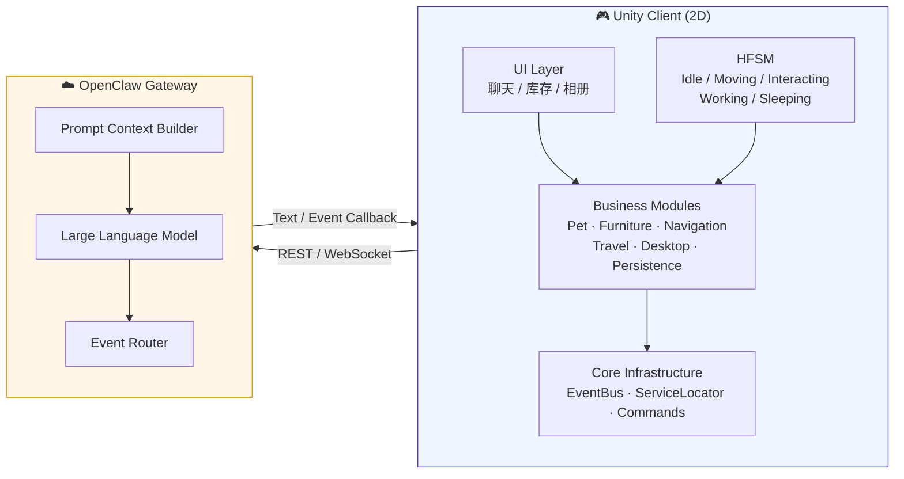

<div align="center">

# 🐾 Gemini-Lab

**新一代 AI 驱动的虚拟宠物陪伴客户端**
*Next-gen AI-powered virtual pet companion built with Unity 2D & OpenClaw Gateway*

[](https://unity.com/releases/editor/whats-new/2022.3)
[](https://docs.unity3d.com/Packages/com.unity.render-pipelines.universal@17.0/manual/2d-index.html)
[](https://learn.microsoft.com/dotnet/csharp/)
[](#)
[](#-license)
[](#-contributing)

</div>

---

## 📖 项目简介

**Gemini-Lab** 是一款基于 **Unity 2022.3 LTS（2D 模板 + URP 2D Renderer）** 开发的 AI 虚拟宠物交互客户端。它深度集成 [**OpenClaw Gateway**](#-openclaw-gateway)，通过**分层有限状态机 (HFSM)** 与**性格驱动大模型**，塑造出具备独立性格、情绪波动与长期记忆的虚拟生命体——它不只是一个桌面挂件，而是你生活与工作中**真正有"灵魂"的陪伴者**。

> 💡 与传统桌宠不同，Gemini-Lab 中的宠物会因为你强制唤醒它而心情变差、会因为经常观察你加班而性格变得"冷静"、会在你打开 VS Code 时主动提议进入"工作模式"，也会自己安排一次旅行回来和你分享照片。

---

## ✨ 核心特性

<table>
<tr>
<td width="50%" valign="top">

### 🏠 双模式场景
- **公寓场景**：2D 俯视正交视角，Tilemap 构建的两房间空间
- **桌面 Overlay**：透明无边框窗口，宠物驻留屏幕边缘
- **无缝切换**：场景状态持久化迁移 ≤ 1s

### 🛋 V-Decor 建造系统
- 长按 `V` 进入建造模式，Grid/Tilemap 吸附
- 家具摆放至地板或墙体（贴墙 Sprite）
- **环境 Buff 聚合**：办公桌缩短工时、地毯提升心情恢复
- 运行时增量烘焙 2D NavMesh，家具摆放即寻路

</td>
<td width="50%" valign="top">

### 🧠 养成与性格演化
- **状态值**：心情 / 饱食 / 精力 / 经验值
- **性格值**：正直 / 冷静 / 邪恶 / 善良 / 勇敢 / 懦弱 / 害羞（7 维动态演化）
- **家具羁绊**：频繁交互生成"习惯标签"反哺性格
- 性格值实时注入 LLM System Prompt，决定语气

### ✈️ 旅行系统
- 发送"去旅游"指令 → 宠物离场
- OpenClaw 异步生成**旅行小记**与**旅行照片**
- 宠物回归时解锁相册、提升"勇敢/见识"

</td>
</tr>
</table>

---

## 🏗 架构总览



### 🔄 通信全流程

1. **Context 组装** — 客户端打包 `User Message` + `State Values` + `Personality` + `Current FSM State`
2. **API 转发** — 经 REST / WebSocket 发送至 OpenClaw Gateway
3. **响应回调**
   - 📝 **文本响应**：渲染聊天气泡，不打断当前状态
   - ⚡ **事件响应**：触发 FSM 切换（工作完成 → Idle）、旅行相册渲染、性格增量写入

---

## 🛠 技术栈

| 分类 | 技术 |
| :--- | :--- |
| **引擎** | Unity 2022.3 LTS · **2D 模板** |
| **渲染** | URP 2D Renderer + 2D Lights · Orthographic Camera |
| **Tilemap** | Grid + Rule Tile + CompositeCollider2D |
| **物理** | Physics2D（Rigidbody2D / Collider2D） |
| **动画** | 2D Animation 包（骨骼 / PSD Importer） + Animator Controller |
| **寻路** | [NavMeshPlus](https://github.com/h8man/NavMeshPlus)（2D NavMesh 端口） |
| **脚本** | C# 10 · Event-Driven Command Pattern |
| **网络** | REST / WebSocket → OpenClaw Gateway |
| **DevTools** | [IvanMurzak / Unity-MCP](https://github.com/IvanMurzak/Unity-MCP)（MCP 编辑器集成） |

---

## 🚀 快速开始

### 环境要求

- ✅ **Unity 2022.3 LTS**（推荐通过 Unity Hub 安装）
- ✅ **Windows 10/11** 或 **macOS 12+**
- ✅ **Git** + **Git LFS**（用于大资源追踪）
- ✅ **.NET SDK 6.0+**
- ✅ **OpenClaw Gateway** 访问凭证（可选；本地开发可使用 Mock Gateway）

### 克隆与安装

```bash
# 1. 克隆仓库（含 LFS 大文件）
git lfs install
git clone https://github.com/<your-org>/Gemini-Lab.git
cd Gemini-Lab

# 2. 在 Unity Hub 中 "Add project from disk" 选择本目录
#    Unity 将自动拉取 Package Manifest 中声明的依赖包

# 3. 打开 Assets/_Project/Scenes/Boot.unity 启动游戏
```

### 首次运行配置

1. 复制 `.env.example` → `.env`（如存在）填写 OpenClaw 访问 Token
2. `Edit → Project Settings → Editor → Default Behavior Mode = 2D`
3. `Graphics → Scriptable Render Pipeline Asset` 指向 `Assets/_Project/Settings/Rendering/URP2D_PC_High.asset`
4. Play `Boot.unity` ▶️

---

## 📂 项目结构

```
Gemini-Lab/
├── Assets/
│   ├── _Project/                    # ⭐ 自研业务唯一落脚点（详见下方说明）
│   │   ├── Scripts/
│   │   │   ├── Core/                # FSM · EventBus · ServiceLocator · Commands
│   │   │   ├── Modules/             # 业务模块（每个独立 asmdef）
│   │   │   │   ├── Pet/             # 宠物状态 & 性格 & FSM
│   │   │   │   ├── Furniture/       # V-Decor 建造 & 环境 Buff
│   │   │   │   ├── Navigation/      # 2D NavMesh (NavMeshPlus)
│   │   │   │   ├── Gateway/         # OpenClaw 通信 & Prompt 组装
│   │   │   │   ├── Travel/          # 旅行指令 & 相册
│   │   │   │   ├── Desktop/         # 桌面 Overlay & 系统感知
│   │   │   │   └── Persistence/     # 存档 & 序列化
│   │   │   ├── UI/                  # MVVM 视图层
│   │   │   └── Editor/              # 编辑器扩展 & MCP 集成
│   │   ├── Prefabs/                 # 预制体（Pet / Furniture / UI / Env / FX）
│   │   ├── ScriptableObjects/       # 数据驱动配置资产
│   │   ├── Scenes/                  # 2D 场景（Boot / Apartment / Overlay / Dev）
│   │   ├── Art/                     # Sprites / Atlases / Tiles / Animations
│   │   ├── Audio/                   # BGM / SFX / Voice
│   │   └── Settings/                # URP 2D / InputActions / Physics2D
│   ├── Plugins/                     # 外部 DLL & 插件（与业务严格隔离）
│   ├── README.md                    # 业务设计文档（系统 & FSM 规范）
│   └── plan.md                      # 敏捷开发计划（Phase 1-4 里程碑）
├── Packages/                        # Unity Package Manifest
├── ProjectSettings/                 # Unity 项目设置
└── README.md                        # ← 你正在阅读的文件
```

> 📘 **每个核心子目录都带有独立的 README**，说明职责、核心类、依赖关系与代码规范。从 `Assets/_Project/README.md` 开始导航。

---

## 🗺 开发路线图

项目按 **4 个阶段** 迭代，总预估周期 **10–14 周**：

| Phase | 主题 | 周期 | 关键交付 |
| :-: | :--- | :-: | :--- |
| **1** | 工程构建 + FSM 核心 | 2–3 周 | HFSM 框架 · 基础设施 · 存档骨架 |
| **2** | V-Decor + 2D NavMesh | 3–4 周 | 家具摆放 · 自主寻路 · 指令打断 |
| **3** | OpenClaw 网关接入 | 2–3 周 | 聊天模式 · 工作模式 · Prompt 注入 |
| **4** | UI + 桌面 Overlay + 旅行 | 3–4 周 | 透明窗口 · 系统感知 · 旅行闭环 |

📋 **详细里程碑、Sprint 拆解、DoD、风险预案** → 参见 [`Assets/plan.md`](Assets/plan.md)

---

## 🤖 AI 辅助开发工具链 (MCP)

项目集成了 **[IvanMurzak / Unity-MCP](https://github.com/IvanMurzak/Unity-MCP)**（Model Context Protocol），允许 Claude / Cursor / ChatGPT 等 Agent **直接操控 Unity 编辑器**：

| 能力 | 示例 |
| :--- | :--- |
| **结构设计** | "帮我按 README 初始化 `_Project/` 目录骨架" |
| **编辑器操作** | 读 Hierarchy、生成 Prefab、挂组件、替换 Sprite |
| **规范审查** | 实时校验 FSM 转移逻辑 / Gateway API 接入规范 |
| **自动化测试** | 一键执行 EditMode / PlayMode 测试并读取结果 |

> 📁 相关 Skill 定义位于 `.cursor/skills/` 下，可在 Cursor 中直接调用。

---

## 🧪 测试

```bash
# 在 Unity 中运行 EditMode 测试
Window → General → Test Runner → EditMode → Run All
```

**覆盖率目标**

- `Scripts/Core/**` ≥ **80%**
- `Scripts/Modules/**` ≥ **60%**
- 端到端冒烟测试 100% 通过（Release 前置条件）

---

## 🤝 Contributing

欢迎提交 Issue 与 PR！在贡献前请先阅读：

1. 🧭 [`Assets/README.md`](Assets/README.md) — 业务与 FSM 设计文档
2. 🗺 [`Assets/plan.md`](Assets/plan.md) — 当前阶段目标与 DoD
3. 📂 各模块 README（位于 `Assets/_Project/**/README.md`）—— 代码规范与依赖边界

### PR 规范

- 所有新增模块必须：独立 asmdef + `Tests/` 目录 + 本级 README
- 禁止跨模块硬引用；仅通过 **EventBus / ServiceLocator / 接口** 通信
- 提交信息遵循 [Conventional Commits](https://www.conventionalcommits.org/)：
  - `feat(pet): add sleeping state transition`
  - `fix(gateway): retry on websocket timeout`
  - `docs(readme): update architecture diagram`

### 代码规范

| 检查点 | 要求 |
| :--- | :--- |
| 命名 | 目录 & 类 `PascalCase`；字段 `_camelCase`（私有）/`camelCase`（局部） |
| UI 层 | **禁止**数据持久化、网络、FSM 业务逻辑 |
| SO 资产 | 运行时**只读**；需动态状态请在 Service 中拷贝 |
| 2D 物理 | 走 `Rigidbody2D.MovePosition`，严禁直接写 `transform.position` |
| 存档 | 必须带 `SchemaVersion`，新增字段走 `SaveMigrator` |

---

## 📜 License

本项目目前 **尚未确定开源协议** (TBD)。在协议明确前，所有代码与资源版权归项目贡献者所有，禁止未授权商用。

---

## 🙏 Acknowledgements

本项目的建设受益于以下开源生态：

- [Unity Technologies](https://unity.com/) — 2D 模板 & URP 2D Renderer
- [NavMeshPlus](https://github.com/h8man/NavMeshPlus) — 2D NavMesh 端口
- [IvanMurzak / Unity-MCP](https://github.com/IvanMurzak/Unity-MCP) — AI Agent 编辑器集成
- [OpenClaw](#) — AI Gateway（项目内部/合作方）

---

<div align="center">

**⭐ 如果这个项目对你有启发，欢迎 Star / Fork / 提 Issue ⭐**

*Crafted with ❤️ by the Gemini-Lab Team*

</div>
